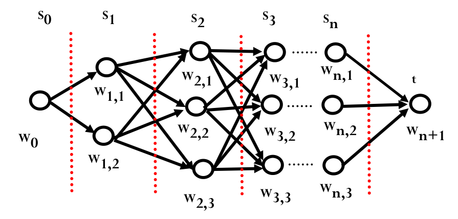
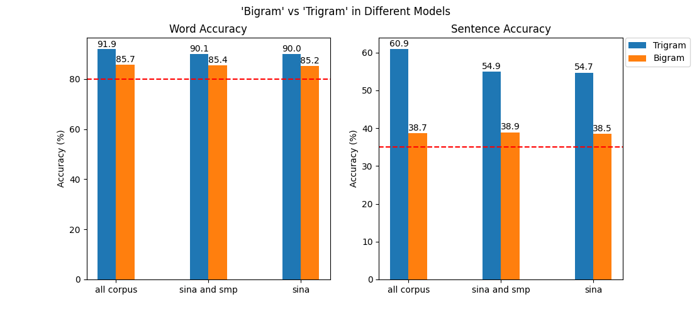
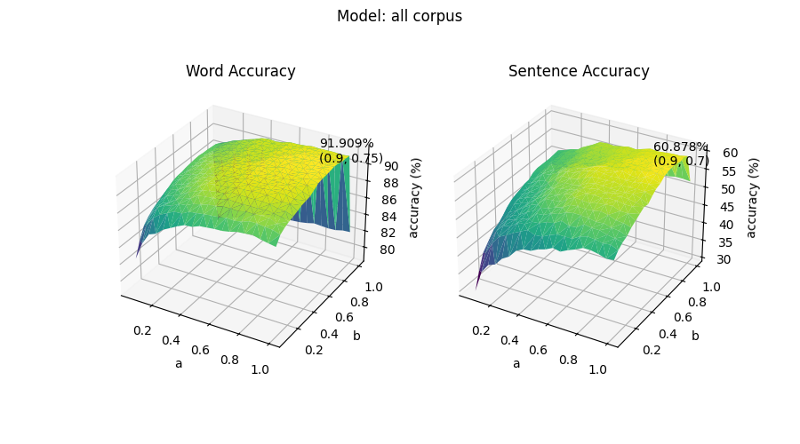
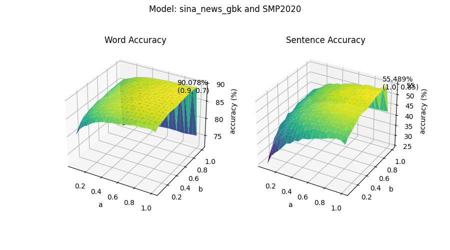
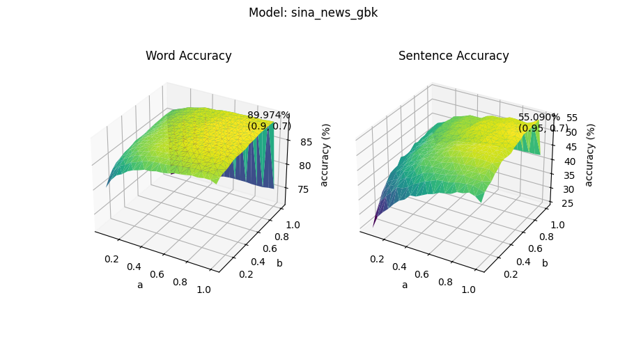

# 拼音输入法

张益铭  2021010552  车13

## 实验环境

- OS: Ubuntu 18.04.6 LTS x86_64

- CPU: 13th Gen Intel i5-13600KF (20) @ 6.500GHz
- GPU: NVIDIA GeForce RTX 4080 16G
- Memory: 32G

## 项目结构

```
.
├── data
│   ├── input.txt
│   ├── output.txt
│   └── std_output.txt
├── README.md
└── src
    ├── corpus*
    ├── models*
    ├── PinyinCharMap
    │   ├── 一二级汉字表.txt
    │   └── 拼音汉字表.txt
    ├── pinyin.py
    ├── requirements.txt
    ├── single_file_processor.py
    ├── train.py
    ├── viterbi_oj.py
    └── viterbi.py

5 directories, 12 files
```

> 注：*代表提交的文件与实际运行相比有所删减

负责处理语料库的文件为`single_file_processor.py`以及`train.py`；viterbi 算法在`viterbi.py`中实现，`viterbi_oj.py`针对 oj 评测修改了读取数据集以及处理输入输出的部分，算法实现大体不变；`pinyin.py`主要负责处理输入输出、计算准确率等杂项。

语料库须保存在`src/corpus`下，形式为一个包含语料库文件的文件夹，可以存放多个语料库。训练时会处理`src/corpus`下所有的语料库文件夹，请**仅**将需要训练的语料库放置其中，**请勿**放置类似`README.md`等与语料库无关的文件。下例为一个合法的存放形式：

```
src/corpus
├── baike2018qa
│   ├── baike_qa_train.json
│   └── baike_qa_valid.json
├── sina_news_gbk
│   ├── 2016-04.txt
│   ├── 2016-05.txt
│   ├── 2016-06.txt
│   ├── 2016-07.txt
│   ├── 2016-08.txt
│   ├── 2016-09.txt
│   ├── 2016-10.txt
│   └── 2016-11.txt
└── SMP2020
    └── usual_train_new.txt

3 directories, 11 files
```

## 语料库

本次大作业使用的语料库为`sina_news_gbk`(831M), `SMP2020`(3.5M), `baike2018qa`(1.5G)，前两个语料库可从[这里](https://cloud.tsinghua.edu.cn/d/66b1261c781146d1b296/)下载，最后一个语料库可从[这里](https://drive.google.com/file/d/1_vgGQZpfSxN_Ng9iTAvE7hM3Z7NVwXP2/view)下载。

正确放置语料库文件后，在`src/`目录下运行`train.py`文件（后续 Python 文件均需要在`src/`下运行）。待程序运行结束后，会在`src/models`下保存处理好的基于字的一元、二元、三元模型，以及拼音汉字表。您也可以在`src/models`下手动创建文件夹并将训练好的模型放置其中，以保存不同语料库生成的模型。如果选择手动操作，请确保在`viterbi.py`文件的第 7-10 行选择要加载的模型。下例为一个合法的存放形式：

```src/models
src/models
├── all_corpus
│   ├── bigrams.pkl
│   ├── dictionary.pkl
│   ├── trigrams.pkl
│   └── unigrams.pkl
├── sina
│   ├── bigrams.pkl
│   ├── dictionary.pkl
│   ├── trigrams.pkl
│   └── unigrams.pkl
└── sina_and_smp
    ├── bigrams.pkl
    ├── dictionary.pkl
    ├── trigrams.pkl
    └── unigrams.pkl

3 directories, 12 files
```

## 数据预处理

- 使用 `SingleFileProcessor` 类和 `ChineseTextProcessor` 类进行数据预处理
  - `SingleFileProcessor` 类用于处理单个文件。首先对文本进行预处理，提取中文文本，并通过正则表达式进行匹配提取中文字符。然后使用提取到的文本同时训练一元、二元、三元模型。
  - `ChineseTextProcessor` 类用于处理整个语料库。调用 `SingleFileProcessor` 处理每个文件，训练完会并合每个文件的结果以更新 Ngram 模型，最后删去出现频率少于 5 次的内容。
  - 最终训练好的 Ngram 模型和字典保存在 `./models` 中。
- 使用了多进程 `Pool` 来加速处理大量文件的过程，提高了处理效率。
  - 训练`sina_news_gbk`以及`SMP2020`大约需要1分24.85秒，再加上`baike2018qa`后共计大约需要6分07.33秒。

## 具体实现

### 基本思路

总体目标为，针对一串拼音序列，找到对应的最大可能的中文字符串。即给定拼音序列$P=\{p_1, p_2, \cdots, p_n\}$，找到最有可能的中文序列$S=\{w_1, w_2, \cdots, w_n\}$
$$
\max\left\{\prod \limits_{i=1}^n P(w_i|w_1\cdots w_{i-1})\right\}\Leftrightarrow \min\left\{-\sum \limits_{i=1}^n \log{P(w_i|w_1\cdots w_{i-1})}\right\}
$$



我们可以维护一个有向连通图。该图可分为 $n$ 层，第 $i$ 层的 $w_{i, 1},w_{i, 2}\cdots,w_{i,k}$ 表示拼音 $s_i$ 对应的所有可能的 $k$ 个汉字。以二元模型为例，定义从 $w_{i-1,j}$ 到 $w_{i,k}$ 的花费 $\mathrm{cost}=-\log{P(w_i|w_{i-1})}$​，需要找到从起点到终点花费最小的路径。

不妨维护一个列表$L$，$L_i$ 中含有 $k$ 个元素，$L_{i,k}$ 只存储到达 $w_{i,k}$ 花费最小的路径以及当前花费，即 $L_{i,k}=(w_1^*w_2^*\cdots w_{i,k},~\mathrm{cost}(w_1^*w_2^*\cdots w_{i,k}))$。运行Viterbi算法时，针对第 $i$ 层每个可能的字，从上一层的 $j$ 条路径中找到到达 $w_{i,k}$ 花费最小的路径，逐层更新列表 $L$。最终到达第 $n$ 层时，列表中 $\mathrm{cost}$​ 最小的字符串即为最终输出。

```python
for i in range(1, len(viterbi_graph)):
    words = []
    for cur in viterbi_graph[i]:
        min_cost = float('inf')
        min_words = ''
        for prev_word, prev_cost in words_list:
            if ngram == 1:
                c = cost(cur, smooth) + prev_cost
            elif ngram == 2 or (ngram == 3 and i == 1):
                c = cost(prev_word[-1] + cur, smooth) + prev_cost
            else:
                c = cost(prev_word[-2:] + cur, smooth) + prev_cost

            if c < min_cost:
                min_cost = c
                min_words = prev_word + cur
        words.append((min_words, min_cost))
    words_list = words
```

Viterbi 算法的关键部分如上所示，其中 $\mathrm{cost}$ 的计算如下：


- 一元模型

  此时退化为求每个单字的最大概率，定义
  $$
  \mathrm{cost}\coloneqq P(w_i)= \dfrac{n_i}{N}
  $$
  其中 $n_i$ 表示 $w_i$ 在语料库中出现的次数，$N$ 表示语料库中单字的数目，根据中心极限定律，近似频率等于概率。

- 二元模型

  $$
  P^\prime(w_i|w_{i-1})=\dfrac{P(w_{i-1}w_i)}{P(w_{i-1})}=\dfrac{n_{i-1, i}}{n_{i-1}}
  $$
  其中 $n_{i-1, i}$ 表示二元词组 $w_{i-1}w_i$ 在语料库中出现的次数。为应对 $P^\prime(w_i|w_{i-1})$ 可能为零的情况，我进行了平滑处理：
  $$
  \mathrm{cost}\coloneqq P(w_i|w_{i-1}) = \lambda P^\prime(w_i|w_{i-1})+(1-\lambda)P(w_i)\quad i.e.,\quad \lambda\dfrac{n_{i-1, i}}{n_{i-1}}+(1-\lambda)\dfrac{n_i}{N}
  $$

- 三元模型

  $$
  P^\prime(w_i|w_{i-2}w_{i-1}) = \dfrac{P(w_{i-2}w_{i-1}w_i)}{P(w_{i-2}w_{i-1})}= \dfrac{n_{i-2, i-1,i}}{n_{i-2,i-1}}
  $$
  其中 $n_{i-2, i-1, i}$ 表示三元词组 $w_{i-2}w_{i-1}w_i$ 在语料库中出现的次数。同样地，进行平滑处理：
  $$
  \begin{align}
  \mathrm{cost}\coloneqq P(w_i|w_{i-2}w_{i-1})& = \mu P^\prime(w_i|w_{i-2}w_{i-1}) + (1-\mu)P(w_i|w_{i-1})\\
  &=\mu\dfrac{n_{i-2, i-1,i}}{n_{i-2,i-1}}+(1-\mu)\left(\lambda\dfrac{n_{i-1, i}}{n_{i-1}}+(1-\lambda)\dfrac{n_i}{N}\right)
  \end{align}
  $$

### 实验效果

运行 `pinyin.py` 时须在命令行指定输入、输出文件位置，例如 `python ./pinyin.py -i ../data/input.txt -o ../data/output.txt`，可通过 `python ./pinyin.py -h` 查询更多指令。

也可直接运行 `python ./viterbi.py`，这样支持用户自行输入拼音进行测试。



上图为在指定平滑参数 $\lambda=0.9,\mu=0.7$​ 时，二元和三元模型在给定测试样例上的字准确率和句准确率，均达到了准确率要求。可见三元模型在句准确率上相比二元模型提升巨大，且加入 `baike2018qa` 语料库后，字和句准确率都有所上升，体现了语料库的选择对输出的影响。

在本实验环境中，加载所有语料库耗时 2.088 秒，使用三元模型处理 501 条拼音输入耗时 4.372 秒，平均⽣成⼀句话耗时 8.727 毫秒。

### 样例分析

- 效果好的例子：

  - ren gong zhi neng ji shu fa zhan xun meng

    人工智能技术发展迅猛

  - bei jing da xue shi shi jie yi liu da xue

    北京大学是世界一流大学

  - ta de ren sheng gui ji jiu shi yi ge tan xin suan fa

    他的人生轨迹就是一个贪心算法

  - zhong guo gong chan dang yuan de chu xin he shi ming shi wei zhong guo ren min mou xing fu wei zhong hua min zu mou fu xing

    中国共产党员的初心和使命是为中国人民谋幸福为中华民族谋复兴

  - ta gan dao tai xing fu le dan ta yi dian ye bu jiao ao yin wei yi ke hao de xin shi yong yuan bu hui jiao ao de

    他感到太幸福了但他一点也不骄傲因为一颗好的心是永远不会骄傲的

- 效果差的例子

  - bei jing shi shou ge ju ban guo xia ao hui yu dong ao hui de cheng shi

    北京**市**首个举办过夏奥会**于**冬奥会的城市 / 北京是首个举办过夏奥会与冬奥会的城市

  - wei ji bai ke shi yi ge wang luo bai ke quan shu xiang mu

    **为几百克食**一个网络百科全书项目 / 维基百科是一个网络百科全书项目

  - zai huo po qi fen zhong ba jian kang zhi shi dai gei da jia

    在活泼**起分钟**把健康知识带给大家 / 在活泼气氛中把健康知识带给大家

可以看出三元语言模型能够拼写出大部分句子，整体上呈现出良好的语言理解和表达能力。但是受限于模型以及语料库，本拼音输入法很难处理多音字、专有名词等情形，对词组的边界定位不清。此外，由于训练使用的大多为新闻稿，因此输入法在一些新闻表述上表现良好，但在较新的领域中表现欠佳，或许可以尝试结合多种技术手段，如语言模型、规则引擎等，来提高输入法的准确性和性能。

### 性能分析

在三元模型下，遍历平滑参数 $\lambda,\mu$ 来观测不同参数对性能的影响：

> 注，图表中 a 对应 $\lambda$，b 对应 $\mu$。





可见随着 $\lambda,\mu$ 的增加，模型逐步由一元变成二元、三元，字与句的准确率也均大致增加。最终我选取 $\lambda,\mu=0.9,0.7$ 作为最优选项。

### 复杂度分析

记一个拼音序列有 $m$ 个拼音，每个拼音有 $n$ 个汉字，如果穷举出所有可能的句子，时间复杂度是 $O(n^m)$。而 Viterbi 算法只需要遍历拼音一遍即可，复杂度为 $O(m)$，对于每个拼音，查询最有可能的汉字的复杂度为 $O(n^2)$，因此总复杂度为 $O(mn^2)$。

平均一个句子有 15 个左右的汉字，平均一个拼音对应 20 个可能的汉字，因此一个句子大约需要计算 6000 次。本环境选用 CPU 频率为 6.5 Ghz，折算后大约需要 1 微秒，可能是由于系统调度、算法常数、性能优化等原因，与实际运行时间 8.727 毫秒相差三个数量级。
