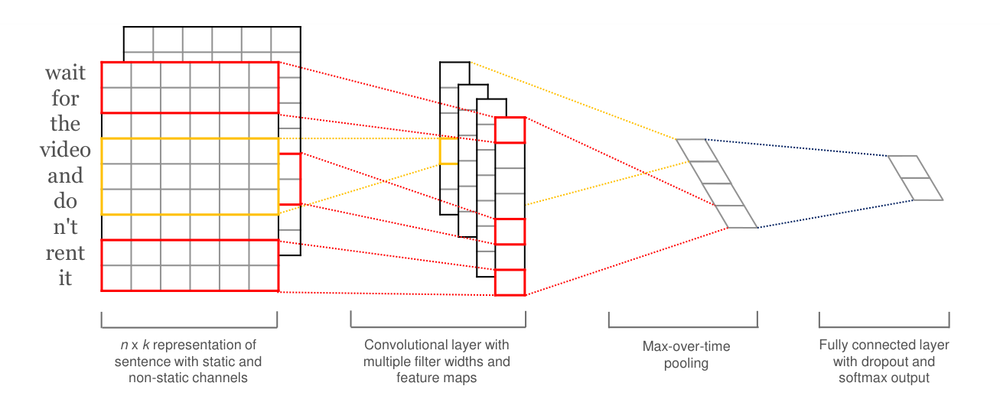
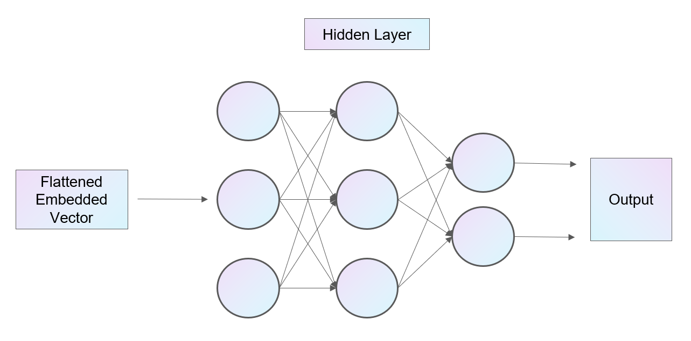
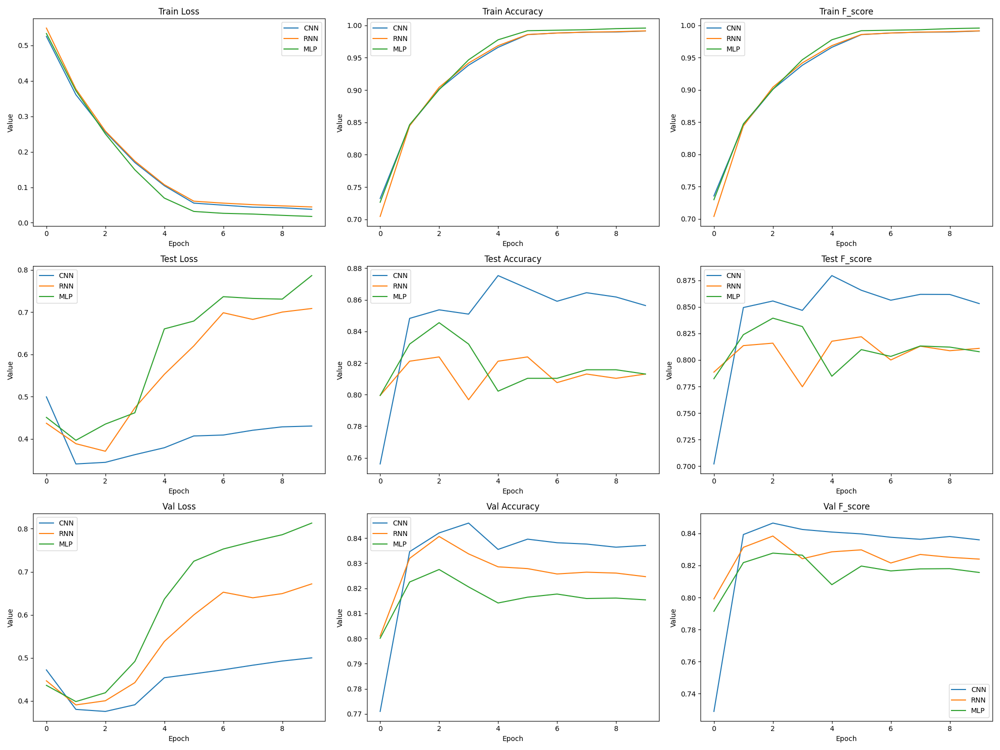
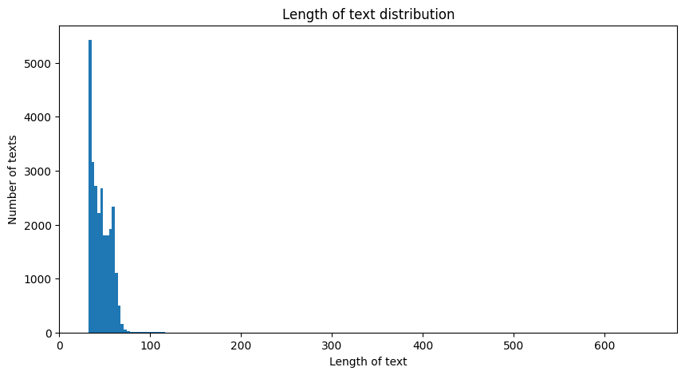

# 文本情感分类

张益铭  2021010552  车13

## 实验环境

- OS: Ubuntu 18.04.6 LTS x86_64
- CPU: 13th Gen Intel i5-13600KF (20) @ 6.500GHz
- GPU: NVIDIA GeForce RTX 4080 16G

项目文件在[这里](https://cloud.tsinghua.edu.cn/d/b69377f39991447dbf5e/)。

## 网络结构

### CNN

本次实验的 CNN 结构参考了 Yoon Kim 提出的[模型](https://arxiv.org/abs/1408.5882)，如下所示：

每个输入的句子先转化为`max_length = 50`的词向量，多出的部分截断，不足的部分补0。输入 x 的维度为`(batch_size, max_length)`。

随后使用预处理的 word2vec 文件创建了一个 embedding layer，将词向量转化为词嵌入，并进行 unsqueeze 操作，将维度转化为`(batch_size, 1, max_length, embedding_dim)`，其中`embedding_dim = 50`。

将嵌入后的的句子输入到 3 个不同大小的卷积层中，卷积核的高度分别为 3, 5, 7，每个卷积核的宽度均为`embedding_dim`，每个卷积层有 50 个通道。这样经过卷积以及 squeeze 操作后，能够得到`(batch_size, num_channels, max_length - k + 1)`大小的输出。

随后对输出进行 max pooling 操作，选出每个通道的最大值。同时为了防止过拟合，使用 dropout 对输出进行处理，再通过全连接层后，最终输出分类结果。

### RNN

本次实验的 RNN 选取了双向 LSTM 模型，如下所示：

同样地，先将输入的句子通过 embedding layer 转化为词嵌入，然后将嵌入后的句子(`max_length` 个 `embedding_dim` 维的词向量)输入到双向 LSTM 中。
最后将 LSTM 输出的最后一个时间步的输出输入到全连接层中，输出分类结果。

### MLP

本次实验的 MLP 结构如下所示：

首先将输入的句子通过 embedding layer 转化为词嵌入，然后将其展平，每个句子变成一个长度为`max_length * embedding_dim`的向量。

随后将展平后的向量输入到一个输入大小为展平向量的维度、输出大小为 hidden_size 的全连接层中，通过激活函数 ReLU 后，再输入到一个输出大小为 2 的全连接层中，得到输出分类结果。

## 实验结果

下表为我挑选的在 validation set 上表现较好的模型在 test set 上的表现：

|          |  CNN   |  RNN   |  MLP   |
| :------: | :----: | :----: | :----: |
| Accuracy | 0.8564 | 0.8130 | 0.8130 |
| F score  | 0.8532 | 0.8110 | 0.8078 |

在训练中，准确率以及 F score 对于超参的选择较为敏感，但大都在上表值的附近波动。

### 模型对比

由上表可以看出，CNN 网络在测试集上的表现最好，准确率有 0.85 左右，而 RNN 和 MLP 的准确率相近，均在 0.81 左右。

此外，我们还可以看到：

- MLP 在训练时 loss 下降最快，同时性能提升也最快，但是它也是最容易出现过拟合的现象的，在测试集上loss最高，准确率最低。
- CNN 训练时 loss 下降和性能提升速度居中，在实际测试上表现最好，过拟合现象相较于其他两个模型更不明显。
- RNN 在训练和测速的表现上都欠佳，可能是由于模型参数过多，训练样本不足导致的。

### 参数选择

#### 学习率

学习率是影响模型训练的重要超参之一，过大的学习率会导致模型无法收敛，而过小的学习率会导致模型收敛速度过慢。在本实验中，我使用了 Adam 优化器，并使用 StepLR 调整学习率，初始学习率为 0.001，每 5 个 epoch 乘以 0.1。这样一来，模型在训练初期能够快速收敛，而在训练后期能够更好地优化模型参数。

我还尝试设置初始学习率为 0.01, 0.0001等，最终发现 0.001 的学习率效果最好，能够在较短的时间内收敛。

#### 语句长度

在本实验中，我统计了数据集中句子包含的词语数量，分别情况如下：

可以看到，大部分句子的长度在 60 以下，我选择了`max_length = 50`，这样能既能够保留大部分信息，又能够减少计算量。

#### 隐藏层大小

在 MLP 以及 RNN 中，都需要设置隐藏层的大小，这也是影响模型性能的参数之一。过大的隐藏层大小会导致训练速度过慢，模型更容易过拟合，而过小的隐藏层大小会导致模型欠拟合，性能不佳。因此，我在实验中尝试了不同的隐藏层大小后，最终选择了 128 作为隐藏层大小。

## 问题思考

### 停止时间

在实验中，训练停止的选择是一个关键问题，影响模型的性能和泛化能力。我首先按照一定的学习率训练了100个epoch，然后观察模型在验证集上的表现，最终确定了10个epoch作为停止时间。

- 固定迭代次数：

  - 优点： 简单易行，不需要额外的计算成本。能够保证训练过程一定程度上的稳定性，避免过早停止。

  - 缺点： 不一定能够找到最优的模型，因为可能在设定的迭代次数内模型尚未收敛或者已经过拟合。可能会浪费计算资源。

- 通过验证集调整：

  - 优点： 当验证集上的性能不再提升或者开始下降时停止训练，能够更加灵活地根据模型的实际表现调整停止时机，避免过拟合，提高泛化能力。

  - 缺点： 需要额外的计算成本，因为需要在每个epoch结束后进行验证集的评估。同时，可能会受到噪声的影响，造成停止时机的不稳定性。

### 参数初始化

常见的初始化方法包括零均值初始化、高斯分布初始化、正交初始化等：

- 零均值初始化： 这是最简单的初始化方法之一，对于很深的网络，初始时所有参数都设为零可以避免一些问题，但也可能陷入局部最优解。
- 高斯分布初始化： 通过从高斯分布中采样参数来初始化，可以使参数具有一定的随机性，有助于模型在训练过程中更快地收敛。
- 正交初始化： 正交初始化可以保持参数之间的正交性，有助于避免梯度消失和爆炸问题，尤其适用于循环神经网络等结构。

选择初始化方法时，需要考虑模型结构、问题的复杂度以及训练数据的特点。通常来说，正交初始化在训练深层网络或者循环神经网络时效果较好，而高斯分布初始化可以应用于各种类型的神经网络。

### 防止过拟合

- 数据增强： 通过对训练数据进行随机变换、旋转、缩放等操作，增加数据的多样性，降低模型对训练数据的依赖性，从而减少过拟合。
- 正则化： 包括L1正则化、L2正则化等，通过对模型的参数添加惩罚项，限制参数的大小，防止模型过度拟合训练数据。
- 早停： 在训练过程中监控模型在验证集上的性能，当性能开始下降时停止训练，避免模型过拟合。
- Dropout： 在训练过程中随机关闭一部分神经元，强制模型学习更加鲁棒的特征，减少神经元之间的依赖关系，从而降低过拟合的风险。

### 网络特性

- CNN

  - 优点：
    - 对于图像等二维数据具有很好的特征提取能力，能够自动学习到局部特征和空间层次结构。
    - 参数共享和局部感知字段的设计减少了参数数量，提高了模型的训练效率。
    - 适用于处理固定大小的输入，不受序列长度影响。
  - 缺点：
    - 对于序列数据等一维数据的处理相对不足，难以捕捉序列中的时间依赖关系。
    - 对于变长序列的处理需要额外的处理，例如采用截断或者填充等方式。

- RNN

  - 优点：
    - 能够处理序列数据，具有记忆功能，能够捕捉序列中的时间依赖关系。
    - 适用于处理变长序列数据，输入输出的长度不受限制。
    - 在自然语言处理等领域有着广泛的应用，能够有效地处理语言模型和文本继续RNN的优缺点分析：

  - 缺点：
    - 容易出现梯度消失或梯度爆炸的问题，导致长期依赖关系难以捕捉。
    - 计算效率较低，每个时间步的计算都依赖于前一个时间步的输出，难以并行化处理。
    - 在处理长序列时，容易出现信息遗忘或者信息混淆的问题。

- MLP

  - 优点：
    - 结构简单直观，易于理解和实现。
    - 适用于各种类型的数据，能够处理任意维度的输入。
    - 在一些简单的任务上，表现良好且训练效率高。
  - 缺点：
    - 参数量较大，容易出现过拟合，需要额外的正则化等方法进行处理。
    - 对于图像和序列等结构化数据的处理能力相对较弱，难以捕捉数据中的局部特征和时间依赖关系。
    - 不适用于处理变长序列数据，需要进行固定长度的输入处理。

## 心得体会

本次实验是我第一次使用深度学习框架进行文本分类任务，从数据处理到模型搭建，再到训练以及测试，我对所学到的知识有了更深的理解。同时，面对实验中大量的超参选择，我体会到了“炼丹”中的不易，需要结合实际情况进行选择，而不是盲目地选择参数。

总体来说，本次实验让我对深度学习有了更深的理解，也让我对文本分类任务有了更多的认识，希望在以后的实验中能够更好地运用所学知识。
